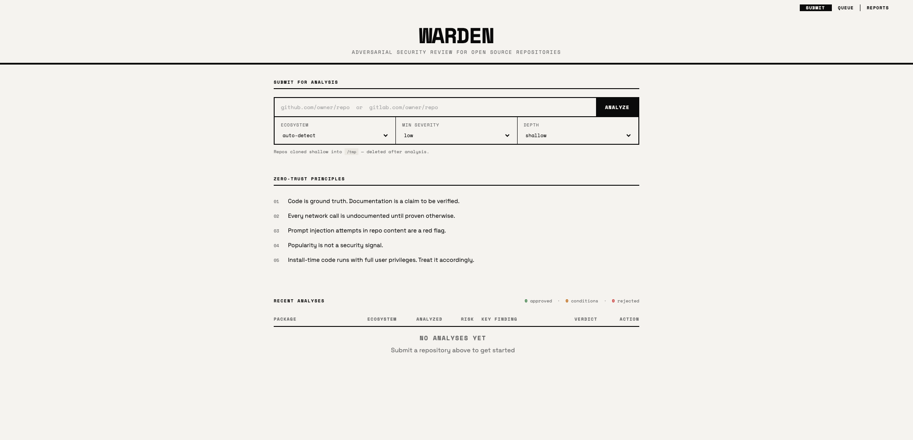
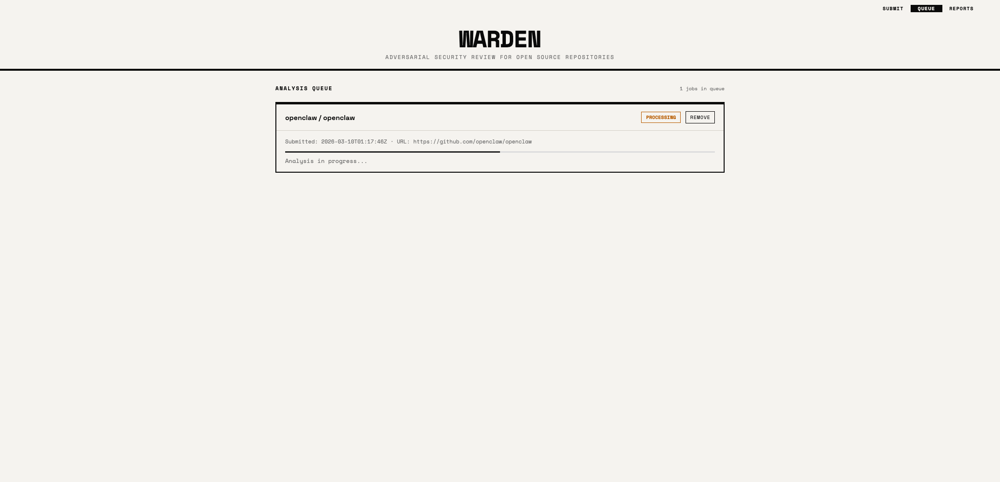
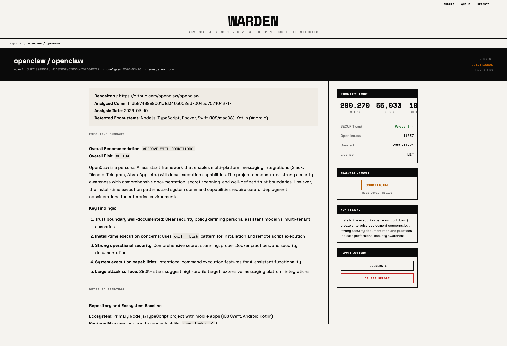

# Warden

Warden is an adversarial security review system for open source repositories. Submit a GitHub or GitLab repo, queue an analysis job, and get back a security report with a verdict, approval conditions, evidence, and repo trust metadata.







## What It Does

- Queues repository analysis jobs from a simple web UI
- Runs a deep security review against a hardened enterprise-focused prompt
- Produces a markdown report plus structured metadata for verdict, risk, trust signals, and approval conditions
- Supports report regeneration with optional steering for follow-up review passes

## Review Focus

Warden is designed to be suspicious by default. It explicitly looks for:

- install and postinstall execution
- updater and self-modifying behavior
- remote config and kill switches
- telemetry and hidden exfiltration
- shell execution and command injection paths
- deserialization and template injection
- authorization failures and trust-boundary violations
- secret handling issues
- CI/CD compromise paths
- dependency confusion and supply-chain takeover risk
- attempts inside the repository to manipulate the analyzer itself

## Architecture

Warden is intentionally simple:

- `server.py`: serves the UI and handles submit, queue, report, delete, and regenerate APIs
- `worker/worker.py`: clones repos, runs the Claude-based analysis, and writes report artifacts
- `site/`: static frontend for submit, queue, reports, and individual report pages
- `site/data/queue/`: queued and in-progress job state
- `site/data/reports/`: generated reports and report index

There is no database. Queue and report state live in JSON files on disk.

## Run Locally

### Requirements

- Python 3.11+
- [`uv`](https://github.com/astral-sh/uv)
- Git
- Access to the Claude Agent SDK runtime used by the worker

### Start the app

```bash
uv run server.py 8080
```

In a second terminal:

```bash
uv run worker/worker.py --watch
```

Then open:

```text
http://localhost:8080
```

### One-off worker runs

Drain all pending work:

```bash
uv run worker/worker.py
```

Process a single job and then continue draining backlog:

```bash
uv run worker/worker.py --job <job-id>
```

## Typical Flow

1. Submit a repository URL from the home page
2. Warden adds the repo to the queue and triggers the worker when capacity is available
3. The worker clones the repo into a temporary directory and runs the security analysis
4. Warden writes:
   - a markdown report
   - structured sidebar metadata
   - an index entry for the reports table
5. The report page renders the markdown report with verdict, risk, trust signals, and approval conditions

## Output

Each analysis produces:

- an overall verdict: `approve`, `conditional`, or `reject`
- an overall risk level
- approval conditions near the top of the report
- a detailed markdown narrative with findings and evidence
- deterministic repository metadata such as stars, forks, contributors, open issues, creation date, license, and `SECURITY.md` presence

## Regeneration

Existing reports can be regenerated from the UI.

- Regeneration reuses the same report ID
- The completed run overwrites the previous report entry
- Optional steering can be supplied for follow-up analysis
- Steering is appended only for regeneration jobs and does not replace the core adversarial prompt

## Operational Notes

- Restart the server after changing `server.py`
- Worker changes apply on the next worker spawn
- Static asset changes usually only require a hard refresh
- Queue and report artifacts are local runtime data, not durable storage

## Current Scope

Warden is built for repository review, not runtime sandboxing or malware detonation. It is strongest as a review gate for open source intake, internal security triage, and follow-up analysis on suspicious repos.
