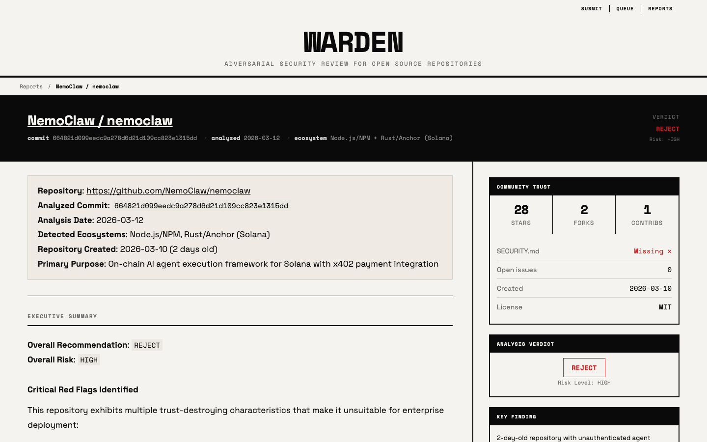

# Warden

Warden is an adversarial security review system for any repository. Submit a GitHub or GitLab repo, queue an analysis job, and get back a security report with a verdict, approval conditions, evidence, and repo trust metadata.




## What It Does

- Queues repository analysis jobs from a simple web UI
- Runs a deep security review against a hardened enterprise-focused prompt
- Produces a markdown report plus structured metadata for verdict, risk, trust signals, and approval conditions
- Supports report regeneration with optional steering for follow-up review passes

## Review Focus

Warden is designed to be suspicious by default. It explicitly looks for:

- install and postinstall execution
- updater and self-modifying behavior
- remote config and kill switches
- telemetry and hidden exfiltration
- shell execution and command injection paths
- deserialization and template injection
- authorization failures and trust-boundary violations
- secret handling issues
- CI/CD compromise paths
- dependency confusion and supply-chain takeover risk
- attempts inside the repository to manipulate the analyzer itself

## Architecture

Warden is intentionally simple:

- `server.py`: serves the UI and handles submit, queue, report, delete, and regenerate APIs
- `worker/worker.py`: clones repos, runs the Claude-based analysis, and writes report artifacts
- `site/`: static frontend for submit, queue, reports, and individual report pages
- `site/data/queue/`: queued and in-progress job state
- `site/data/reports/`: generated reports and report index

There is no database. Queue and report state live in JSON files on disk.

## Run Locally

### Requirements

- Python 3.11+
- [`uv`](https://github.com/astral-sh/uv)
- Git
- Access to an LLM gateway compatible with the worker
- `WARDEN_MODEL`, `OPENAI_COMPATIBLE_ENDPOINT`, and `NVIDIA_API_KEY` exported in your shell

The worker talks to an OpenAI-compatible chat completions API via LangChain. `OPENAI_COMPATIBLE_ENDPOINT` can point to any service that supports the OpenAI chat completions format, not just one specific vendor.

Example:

```bash
export WARDEN_MODEL="your-model-name"
export OPENAI_COMPATIBLE_ENDPOINT="https://your-endpoint.example/v1"
export NVIDIA_API_KEY="your-api-key"
```

### Configuration

Create a `.env` file and set your runtime values:

```dotenv
WARDEN_MODEL=your-model-name
OPENAI_COMPATIBLE_ENDPOINT=https://your-endpoint.example/v1
NVIDIA_API_KEY=your-api-key
```

### Start the app

```bash
uv run server.py
```

In a second terminal:

```bash
uv run worker/worker.py --watch
```

Then open:

```text
http://localhost:12000
```

### One-off worker runs

Drain all pending work:

```bash
uv run worker/worker.py
```

Process a single job and then continue draining backlog:

```bash
uv run worker/worker.py --job <job-id>
```

## Docker

Create a `.env` file with:

```dotenv
WARDEN_MODEL=your-model-name
OPENAI_COMPATIBLE_ENDPOINT=https://your-endpoint.example/v1
NVIDIA_API_KEY=your-api-key
```

`OPENAI_COMPATIBLE_ENDPOINT` can be any endpoint that supports the OpenAI chat completions format.

Start the app:

```bash
docker compose up --build -d
```

Open:

```text
http://localhost:12000
```

Stop it:

```bash
docker compose down
```

## Typical Flow

1. Submit a repository URL from the home page
2. Warden adds the repo to the queue and triggers the worker when capacity is available
3. The worker clones the repo into a temporary directory and runs the security analysis
4. Warden writes:
   - a markdown report
   - structured sidebar metadata
   - an index entry for the reports table
5. The report page renders the markdown report with verdict, risk, trust signals, and approval conditions

## REST API

The web UI uses the same runtime state exposed by the API. Agent callers only need one stable ID: the `jobId` returned by submit. That ID is also the completed report ID.

Submit a repository:

```bash
curl -s http://localhost:12000/api/submit \
  -H 'Content-Type: application/json' \
  -d '{
    "url": "https://github.com/openai/openai-python",
    "ecosystem": "auto",
    "severity": "low",
    "depth": "shallow"
  }'
```

The response includes `jobId`, `statusUrl`, `reportUrl`, and `links`.

Poll job status:

```bash
curl -s http://localhost:12000/api/jobs/<job-id>
```

Status is `pending`, `processing`, `failed`, or `succeeded`. When a worker completes a job, Warden removes it from the queue and `/api/jobs/<job-id>` returns `succeeded` by resolving the completed report.

Get a completed report:

```bash
curl -s http://localhost:12000/api/reports/<report-id> -o warden-report.json
```

Reports include full markdown content and can be long. Write them to a file first, then inspect with `jq`, an editor, or a pager.

Search reports for a repository:

```bash
curl -s 'http://localhost:12000/api/reports?provider=github&owner=openai&repo=openai-python' -o warden-report-search.json
curl -s 'http://localhost:12000/api/reports?repository=openai/openai-python' -o warden-report-search.json
```

Search responses are smaller than full reports, but writing them to a file keeps terminal output predictable.

## Output

Each analysis produces:

- an overall verdict: `approve`, `conditional`, or `reject`
- an overall risk level
- approval conditions near the top of the report
- a detailed markdown narrative with findings and evidence
- deterministic repository metadata such as stars, forks, contributors, open issues, creation date, license, and `SECURITY.md` presence

## Regeneration

Existing reports can be regenerated from the UI.

- Regeneration reuses the same report ID
- The completed run overwrites the previous report entry
- Optional steering can be supplied for follow-up analysis
- Steering is appended only for regeneration jobs and does not replace the core adversarial prompt

## Operational Notes

- Restart the server after changing `server.py`
- Worker changes apply on the next worker spawn
- Static asset changes usually only require a hard refresh
- Queue and report artifacts are local runtime data, not durable storage

## Current Scope

Warden is built for repository review, not runtime sandboxing or malware detonation. It is strongest as a review gate for repo intake, internal security triage, and follow-up analysis on suspicious repos.
